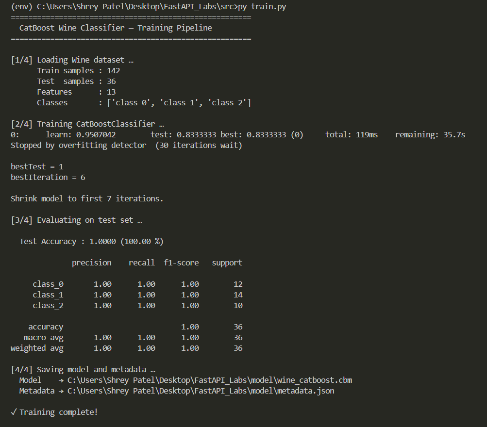

## Overview

## CatBoost Wine Classifier

### What Changed

| Area | v1 (Original) | v2 (Updated) |
|------|--------------|-------------|
| **Model** | `DecisionTreeClassifier` (scikit-learn) | `CatBoostClassifier` (gradient boosting) |
| **Dataset** | Iris (4 features, 3 classes) | Wine Recognition (13 features, 3 classes) |
| **Model file** | `iris_model.pkl` (joblib) | `wine_catboost.cbm` (CatBoost native) |
| **Endpoints** | 2 (`GET /`, `POST /predict`) | 8 (see table below) |
| **Response** | Single integer class | Class name, probabilities, confidence, feature explanation |
| **Model loading** | Re-loaded from disk on every request | Loaded once at import (singleton) |

### New Files

| File | Purpose |
|------|---------|
| `src/schemas.py` | All Pydantic request/response models with field validation |
| `src/logger.py` | In-memory prediction history store (deque, max 1000 entries) |
| `model/metadata.json` | Model accuracy, feature importances, class names, trained timestamp |

Install with:
```bash
pip install -r requirements.txt
```

### Retraining the Model

```bash
cd src
python train.py
```

This will:
1. Load the **Wine Recognition** dataset (178 samples, 13 features)
2. Train a `CatBoostClassifier` for 300 iterations with early stopping
3. Print accuracy + classification report
4. Save `../model/wine_catboost.cbm` and `../model/metadata.json`

### API Endpoints (v2)

| Method | Route | Tag | Description |
|--------|-------|-----|-------------|
| `GET` | `/` | System | Health check + uptime + model name |
| `GET` | `/model/info` | Model | Accuracy, feature importances, trained timestamp |
| `GET` | `/classes` | Model | Wine class id → name mapping |
| `POST` | `/predict` | Inference | Classify one wine: class, probabilities, confidence, top-3 feature explanation |
| `POST` | `/predict/batch` | Inference | Classify up to 50 wine samples at once |
| `GET` | `/history` | Analytics | Last N logged predictions (newest first) |
| `GET` | `/stats` | Analytics | Total requests, per-class counts, avg confidence |
| `DELETE` | `/history` | Analytics | Clear prediction history |

### Sample Request / Response

**POST /predict**
```json
{
  "alcohol": 13.2,
  "malic_acid": 1.78,
  "ash": 2.14,
  "alcalinity_of_ash": 11.2,
  "magnesium": 100.0,
  "total_phenols": 2.65,
  "flavanoids": 2.76,
  "nonflavanoid_phenols": 0.26,
  "proanthocyanins": 1.28,
  "color_intensity": 4.38,
  "hue": 1.05,
  "od280_od315": 3.4,
  "proline": 1050.0
}
```

**Response**
```json
{
  "class_id": 0,
  "class_name": "class_0",
  "probabilities": { "class_0": 0.982, "class_1": 0.012, "class_2": 0.006 },
  "confidence": 0.982,
  "top_features": [
    { "feature": "proline", "value": 1050.0, "importance": 0.312, "contribution_score": 0.451 },
    { "feature": "flavanoids", "value": 2.76, "importance": 0.189, "contribution_score": 0.201 },
    { "feature": "color_intensity", "value": 4.38, "importance": 0.154, "contribution_score": 0.112 }
  ]
}
```

### Running Server

```bash
cd src
uvicorn main:app --reload
```

Then visit:
- **[http://127.0.0.1:8000/docs](http://127.0.0.1:8000/docs)** — interactive Swagger UI
- **[http://127.0.0.1:8000/redoc](http://127.0.0.1:8000/redoc)** — ReDoc documentation

### Project structure

```
mlops_labs
└── fastapi_lab1
    ├── assets/
    ├── fastapi_lab1_env/
    ├── model/
    │   └── wine_catboost.cbm
    ├── src/
    │   ├── __init__.py
    │   ├── data.py
    │   ├── logger.py
    │   ├── schemas.py
    │   ├── main.py
    │   ├── predict.py
    │   └── train.py
    ├── README.md
    └── requirements.txt
```

