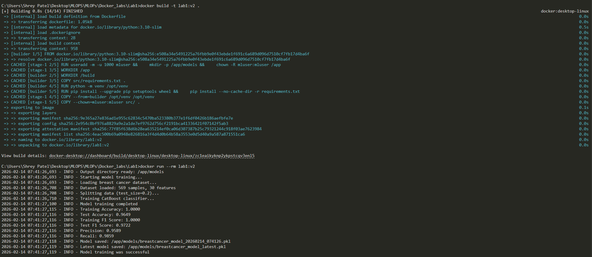

# Docker Lab 1: ML Model Training Container

## A production-ready Docker container for training a CatBoost classifier on the breast cancer dataset.

#### Dockerfile Improvements

- **Multi-stage Build**: Reduces final image size by ~50% using a builder stage
- **Environment Variables**: Configurable model output directory and Python settings
- **Better Dependency Management**: Virtual environment for isolated dependencies with proper caching

#### Code Enhancements

- **Logging**: File and console logging with timestamps
- **Enhanced Metrics**: Precision, recall, and test set metrics in addition to accuracy
- **Models Saving**: Models saved with timestamps for version tracking

---

## Commands

### Build the Image

```bash
docker build -t lab1:v2 .
```

### Run the Container

**Basic execution:**

```bash
docker run --rm lab1:v2
```

**Custom model output directory:**

```bash
docker run --rm -e MODEL_OUTPUT_DIR=/custom/path lab1:v2
```

---

## Training Output

The container generates:

- **Timestamped Model**: `breastcancer_model_YYYYMMDD_HHMMSS.pkl` (e.g., `breastcancer_model_20260214_143022.pkl`)
- **Latest Model**: `breastcancer_model_latest.pkl`
- **Training Logs**: `training.log`

**Example Output:**

```
2026-02-14 14:30:22,456 - INFO - Starting model training...
2026-02-14 14:30:22,789 - INFO - Loading breast cancer dataset...
2026-02-14 14:30:22,890 - INFO - Dataset loaded: 569 samples, 30 features
2026-02-14 14:30:22,950 - INFO - Test Accuracy: 0.9649
2026-02-14 14:30:22,951 - INFO - Test F1 Score: 0.9641
2026-02-14 14:30:22,952 - INFO - Model saved: /app/models/breastcancer_model_20260214_143022.pkl
```

---

## Model Dataset Information

- **Dataset**: Breast Cancer Wisconsin Dataset
- **Samples**: 569
- **Features**: 30
- **Classes**: 2 (Malignant/Benign)
- **Train/Test Split**: 80/20
- **Algorithm**: CatBoost Classifier (100 iterations)

---

## File Structure

```
Lab1/
├── Dockerfile              # Docker configuration
├── ReadMe.md              # This file
└── src/
    ├── main.py            # ML training script with logging
    ├── requirements.txt    # Python dependencies
    └── training.log       # Generated during training
```

---

## Local Run Screenshots


